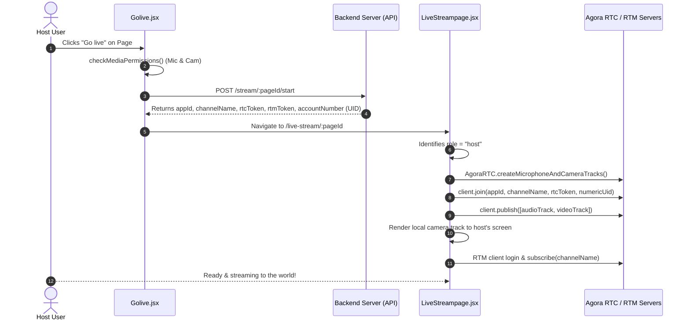
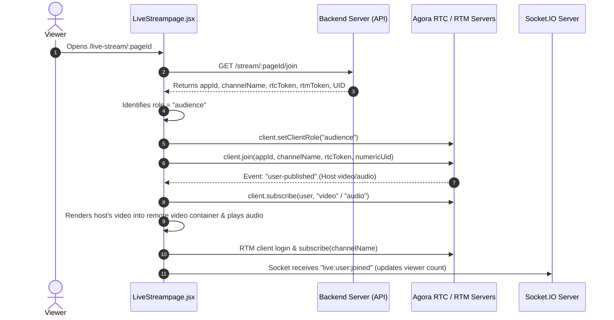

# 🎥 Live Streaming Architecture & Workflow Guide

A beginner-friendly guide to understanding how live streaming, real-time video/audio, live chat, and viewer tracking work in this project.

---

## 🌟 1. High-Level Overview

Live streaming in this application combines **four main building blocks**:

```
+-----------------------------------------------------------------------------------+
|                                  TOPX LIVESTREAM                                  |
+-----------------------------------------------------------------------------------+
|                                                                                   |
|  1. REST API (Backend)        -> Generates Agora tokens, channels, & session state|
|  2. Agora RTC SDK             -> High quality, low-latency Video & Audio streaming|
|  3. Agora RTM SDK             -> Real-time live comments & hearts/likes           |
|  4. WebSockets (Socket.IO)    -> Viewer join/leave events & viewer counters       |
|                                                                                   |
+-----------------------------------------------------------------------------------+
```

---

## 📁 2. Key Files & Their Responsibilities

| File Path | Purpose |
| :--- | :--- |
| [`src/pages/Others/Golive.jsx`](file:///c:/Users/pt/Desktop/Abdul_Hannan/TopX-Web/src/pages/Others/Golive.jsx) | Host selection page: picks a page to stream on, requests camera/mic permissions, and triggers stream start. |
| [`src/pages/Others/LiveStreampage.jsx`](file:///c:/Users/pt/Desktop/Abdul_Hannan/TopX-Web/src/pages/Others/LiveStreampage.jsx) | The main streaming room component for **both** Host and Audience. Orchestrates RTC, RTM, video feeds, and UI. |
| [`src/hooks/useAgora.jsx`](file:///c:/Users/pt/Desktop/Abdul_Hannan/TopX-Web/src/hooks/useAgora.jsx) | Custom hook managing Agora RTC client (joining channel, publishing camera/mic tracks, subscribing to remote streams). |
| [`src/hooks/useRTM.jsx`](file:///c:/Users/pt/Desktop/Abdul_Hannan/TopX-Web/src/hooks/useRTM.jsx) | Custom hook managing Agora RTM client (live messaging, comments pub/sub, sending and receiving likes). |
| [`src/redux/slices/livestream.slice.jsx`](file:///c:/Users/pt/Desktop/Abdul_Hannan/TopX-Web/src/redux/slices/livestream.slice.jsx) | Redux state for API calls: `startStream`, `joinStream`, `endStream`. |
| [`src/components/livestream/LiveCommentsLikes.jsx`](file:///c:/Users/pt/Desktop/Abdul_Hannan/TopX-Web/src/components/livestream/LiveCommentsLikes.jsx) | The chat sidebar overlay displaying incoming comments, input box, and like button. |
| [`src/context/SocketContext.jsx`](file:///c:/Users/pt/Desktop/Abdul_Hannan/TopX-Web/src/context/SocketContext.jsx) | WebSockets provider for real-time presence (`live:user:joined`, `live:user:left`). |
| [`src/components/global/LivePermissionModal.jsx`](file:///c:/Users/pt/Desktop/Abdul_Hannan/TopX-Web/src/components/global/LivePermissionModal.jsx) | Modal shown if browser denies camera or microphone access. |

---

## 🔄 3. Step-by-Step Workflow

### Flow A: Host Starts a Stream (Broadcasting)



1. **Permission Check:** In [`Golive.jsx`](file:///c:/Users/pt/Desktop/Abdul_Hannan/TopX-Web/src/pages/Others/Golive.jsx), browser verifies that camera and microphone permissions are granted.
2. **Start Stream API:** Calls `POST /stream/:pageId/start`. The backend generates unique Agora RTC and RTM tokens with a channel name and numeric user account ID.
3. **Transition to Live Room:** Redirects the host to `/live-stream/:pageId`.
4. **Initialize Host RTC:**
   - [`useAgora.jsx`](file:///c:/Users/pt/Desktop/Abdul_Hannan/TopX-Web/src/hooks/useAgora.jsx) creates the Agora RTC client in `"host"` mode.
   - Captures local hardware with `AgoraRTC.createMicrophoneAndCameraTracks()`.
   - Joins channel and calls `client.publish([audioTrack, videoTrack])`.
   - Displays local video feed in the host's video container.
5. **Initialize Host RTM:** Connects to Agora RTM to receive live chat messages and likes.

---

### Flow B: Viewer Joins a Stream (Watching)



1. **Role Check & Credentials:** When a viewer opens `/live-stream/:pageId`, the component recognizes they are not the page owner and sets role to `"audience"`.
2. **Join Stream API:** Calls `GET /stream/:pageId/join` to get read-only Agora tokens.
3. **Subscribe to Video & Audio:**
   - RTC client joins in `"audience"` mode (no camera or microphone required).
   - When the host's video/audio stream arrives, Agora fires `"user-published"`.
   - [`useAgora.jsx`](file:///c:/Users/pt/Desktop/Abdul_Hannan/TopX-Web/src/hooks/useAgora.jsx) subscribes to the tracks and mounts them dynamically onto the video DOM container.
4. **Live Chat & Presence:**
   - Viewer connects to RTM channel for real-time messages.
   - Socket event `live:user:joined` fires and updates viewer counters on both host and viewer screens.

---

### Flow C: Live Comments & Likes (Agora RTM)

```
[User types comment / taps heart]
              │
              ▼
   sendComment() / sendLike() in useRTM.jsx
              │
   (Optimistic UI update: message appears immediately)
              │
              ▼
Agora RTM Client: client.publish(channelName, JSON.stringify(payload))
              │
              ▼
Agora RTM Network distributes payload to everyone in channel
              │
              ▼
client.on("message"):
  - Parse JSON message payload
  - Format into comment object
  - Append to comments state in LiveCommentsLikes.jsx
```

- **Optimistic UI:** When a user types a comment, it appears on their own screen right away while sending over the wire for snappy UX.
- **RTM Pub/Sub:** All participants in the same `channelName` receive published messages instantly.

---

### Flow D: Ending the Stream

1. Host clicks **"End Stream"**:
   - Dispatches `PATCH /stream/:pageId/end` to notify backend database to mark stream as finished.
   - Calls `leave()` in [`useAgora.jsx`](file:///c:/Users/pt/Desktop/Abdul_Hannan/TopX-Web/src/hooks/useAgora.jsx): stops camera/microphone hardware tracks, closes tracks, and leaves Agora channel.
   - Unsubscribes from RTM and logs out.
   - Sockets emit `live:ended` to inform all remaining viewers.
   - Host is navigated back to `/home`.

---

## 🛡️ 4. Permissions & Error Handling

- **Camera & Mic Access:** Handled before entering stream in [`src/lib/helpers.js`](file:///c:/Users/pt/Desktop/Abdul_Hannan/TopX-Web/src/lib/helpers.js) with `navigator.mediaDevices.getUserMedia()`. If blocked, [`LivePermissionModal.jsx`](file:///c:/Users/pt/Desktop/Abdul_Hannan/TopX-Web/src/components/global/LivePermissionModal.jsx) guides the user to enable permissions in browser settings.
- **Audience Safety:** Viewers are strictly set to `role = "audience"`, ensuring their camera and mic are never requested or turned on.
- **Cleanup:** On component unmount, all active tracks, listeners, and container elements are cleanly destroyed to prevent memory leaks and stuck camera indicators.

---

## 📊 5. Summary Cheat Sheet

| Feature | Tech Used | How It Works |
| :--- | :--- | :--- |
| **Video & Audio Stream** | **Agora RTC** | WebRTC-based low-latency streaming between Host & Viewers. |
| **Live Comments & Likes** | **Agora RTM** | Real-time channel pub/sub sending JSON payloads. |
| **Viewer Count & Presence**| **Socket.IO** | WebSocket broadcast events (`live:user:joined`, `live:user:left`). |
| **Stream Authentication** | **Express API + Redux** | Generates temporary secure RTC/RTM tokens per session. |
